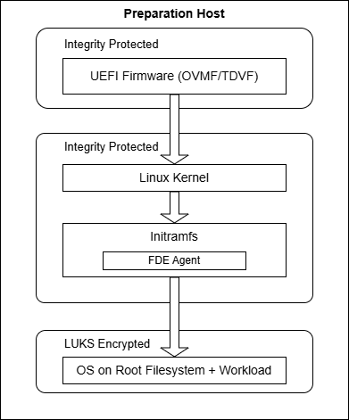
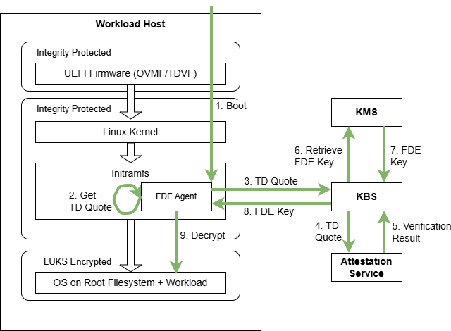

# Full Disk Encryption Solution for an Intel TDX

In short, the goal of this solution is that a Workload Owner is able to protect all data and code of its workload in use and at rest.
The data in use protection is provided by putting the workload inside a VM protected by [Intel® Trust Domain Extensions (Intel® TDX)](https://www.intel.com/content/www/us/en/developer/articles/technical/intel-trust-domain-extensions.html), i.e., by Trust Domains (TDs).
The data at rest protection is provided by Full disk encryption (FDE), a security method for protecting sensitive data by encrypting all data on disk to prevent unauthorized access.

In the next section, we first provide more background in FDE and Intel TDX.
Next, we provide a high-level overview of the solution and the assumptions we have about the components making up the solution.
Afterwards, we provide a detailed flow of the setup and runtime phase.


## Background

### Full Disk Encryption (FDE)

Full disk encryption is a robust security measure for safeguarding the contents of digital storage devices, including hard drives, SSDs, and virtual disks for VMs, through seamless encryption.
This protective shield extends to applications, user files, and even the OS.
The core objective of FDE is to thwart unauthorized access to sensitive information, particularly in scenarios involving device theft, loss, or unauthorized physical access.

The mechanics of FDE involve the utilization of a cipher, typically a block cipher, to encrypt data at rest on the storage device.
To initiate the process, a user or device manufacturer must initialize the storage device by providing an encryption key or passphrase.
This action creates and writes a special metadata structure on the device, representing an initially empty state encrypted with the provided key.

Each time the system powers on or the device is accessed, a key or a passphrase is needed to decrypt and read or write data on the device.
This key is not stored on the device itself and must be provided for every use of the device.
It is typically cached in a volatile and protected memory area and erased when the device is no longer in use, or the system is shut down.

LUKS (Linux Unified Key Setup) is a disk encryption specification commonly used to implement Full Disk Encryption (FDE) on Linux systems.


### Intel® Trust Domain Extensions (Intel® TDX) Background

Intel® Trust Domain Extensions (Intel® TDX) is Intel's newest Confidential Computing technology.
This hardware-based Trusted Execution Environment (TEE) facilitates the deployment of Trust Domains (TD), which are hardware-isolated virtual machines (VM) designed to protect sensitive data and applications from unauthorized access.

One main feature of Intel TDX is remote attestation.
At its core, remote attestation is a process used by software to demonstrate to a remote party that the software has been properly instantiated on a platform.
Intel TDX attestation allows a remote party to ensure that a Virtual Machine (VM) is using Intel TDX for hardware-isolation and protection, as well as ensuring all components of the Intel TDX Trusted Compute Base (TCB) are up to date (or at an expected level).

The base piece of information used for Intel TDX remote attestation is called a quote, or more explicitly for Intel TDX, a TD Quote.
A TD Quote is a cryptographic attestation, or secure proof, generated by Intel TDX hardware to prove the authenticity and state of a Trust Domain (TD).

For more details, see [Intel's Intel TDX page](https://www.intel.com/content/www/us/en/developer/tools/trust-domain-extensions/overview.html) and the [Intel® TDX Enabling Guide](https://cc-enabling.trustedservices.intel.com/intel-tdx-enabling-guide/01/introduction/).


## High-level Overview of FDE + Intel TDX

On this page, we describe one possibility on how to combine FDE with Intel TDX.
The process splits into a preparation phase and a runtime phase.

Overall, the following components play a role in the two phases:
- A "Preparation Host" that the Workload Owner uses to prepare a UEFI firmware and TD image containing its workload.
    The Preparation host does not require Intel TDX support.
- A "Workload Host" that starts a TD based on the prepared UEFI firmware and TD image.
    The Workload Host requires Intel TDX support.
- A "Key Management Service (KMS)" for securely creating and storing the key used for FDE.
- An "Attestation Service" responsible to verify a TD Quote.
- A "Key Broker Service (KBS)" responsible for accepting a TD Quote, forwarding the TD Quote to the Attestation Service for quote verification, requesting the key used for FDE from the KMS, and securely return the key into the TD.

We do not make any assumption where exactly all the individual components are deployed - the components might run on the same physical machine, some components might be co-located, or each might be on a separate machine.

The only important restriction is that the Workload Owner fully trusts the environment(s) containing the Preparation Host, the KMS, the KBS, and the Attestation Service.
Conversely, the Workload Owner does not have to trust the environment containing the Workload Host.


### Preparation Phase

The preparation phase involves multiple tasks:
1. Setup a Workload Host.
2. Setup a KMS.
3. Setup a KBS.
4. Prepare UEFI Firmware and TD image on Preparation Host and Workload Host.

The first three steps are rather self-describing and we refer for later sections for details.
The fourth step is elaborate in itself and we want to present a few details here.
The goal of this task is to prepare a UEFI firmware (e.g., OVMF or TDVF) and a TD image.
The UEFI firmware must be enabled for Intel TDX and its integrity is protected by remote attestation.
The TD image contains a bootloader, a Linux kernel, initramfs with an "FDE Agent", and a root filesystem partition with the OS and workload.
The root filesystem is encrypted using LUKS2 and all other pieces of the TD image are integrity protected by remote attestation.

The following figure shows result of the preparation and the boot flow of the components:



The Workload Owner generates the encryption key for LUKS2 and stores it in the KMS during the preparation phase.


### Runtime Phase

On a high level, the following is done during the runtime phase, which is also visualized in the next figure:
1. Boot the TD until initramfs.
2. Initramfs starts the FDE Agent, which initiates key retrieval from KBS, which invokes the KBS attestation protocol.
3. The attestation protocol executes automatically:
    - TD Quote is generated with a nonce and hash of the ephemeral public key (PK<sub>KR</sub>)
    - KBS receives and forwards the quote to CoCo Attestation Service for verification
    - Attestation Service validates the quote and returns a signed attestation token
    - KBS verifies the token against the attestation policy
    - If verified, KBS retrieves k<sub>RFS</sub> from Vault and securely transmits it to the FDE Agent
4. FDE Agent receives k<sub>RFS</sub>, decrypts the root filesystem, and continues the boot process.




## Detailed Recipe for FDE + Intel TDX

For this detailed recipe of our solution, we assume that [HashiCorp Vault](https://www.hashicorp.com/de/products/vault) is used as KMS, and [Trustee](https://github.com/confidential-containers/trustee) provides both the Attestation Service (AS) and Key Broker Service (KBS).
As mentioned before, we do not make any assumption where exactly all the individual components are deployed - the components might run on the same physical machine, some components might be co-located, or each might be on a separate machine.

For ease of explanation in this recipe, **we assume that all components are deployed on the same physical machine**.
Please adjust the commands according to your environment.

Note that the TD image using FDE currently only supports Ubuntu 24.04.

### Preparation Phase

#### Setup Workload Host

1. Verify that supported hardware is used following the [Supported Hardware section](https://github.com/canonical/tdx/tree/3.1?tab=readme-ov-file#3-supported-hardware) of Canonical's guide.
2. Setup the host OS and BIOS settings following the [Setup Host OS section](https://github.com/canonical/tdx/tree/3.1?tab=readme-ov-file#4-setup-host-os) of Canonical's guide.
3. Setup remote attestation and register your platform according to the [Setup Intel® SGX Data Center Attestation Primitives (Intel® SGX DCAP) on the Host OS section](https://github.com/canonical/tdx/tree/3.1?tab=readme-ov-file#82-setup-intel-sgx-data-center-attestation-primitives-intel-sgx-dcap-on-the-host-os) of Canonical's guide.

#### Setup Trustee KBS, CoCo Attestation Service and HashiCorp Vault
1. Install docker and enable it for non-root users:
    ```
    curl -fsSL https://get.docker.com -o get-docker.sh
    sudo sh get-docker.sh
    sudo usermod -aG docker $USER
    newgrp docker
    ```
    See [Docker's installation documentation](https://docs.docker.com/engine/install/ubuntu/) for more detailed information.

2. Install required dependencies:
    ```
    sudo apt update
    sudo apt install -y build-essential
    ```

3. Download FDE solution:
    ```
    git clone https://github.com/intel/confidential-computing-tools.git fde
    ```

4. Download Trustee:
    ```
    git clone -b v0.15.0 https://github.com/confidential-containers/trustee.git
    ```

5. Copy setup script and patch to trustee directory.
    ```
    cp fde/full-disk-encryption/setup_trustee.sh fde/full-disk-encryption/patches/trustee-kbs.patch trustee/ 
    ```

6. Create configuration directory:
    ```
    mkdir -p trustee/config-data/
    ```

7. Generate self-signed certificate for secure HTTPS communication:

    **Disclaimer: Self-Signed Certificate Usage:**
    
    The self-signed certificate generated by these instructions is intended **for demo and testing purposes only**. It is inherently insecure and **MUST NOT be used in a production environment**.
    For production deployments, you must use a certificate issued by a trusted root Certificate Authority (CA) to ensure secure communication.
    ```
    pushd trustee/config-data/
    
    # Detect your system IP
    SYSTEM_IP=$(hostname -I | awk '{print $1}')

    # Create certificate configuration
    cat > cert.conf <<EOF
    [req]
    default_bits = 3072
    default_md = sha256
    distinguished_name = req_distinguished_name
    req_extensions = req_ext
    x509_extensions = v3_ca

    [req_distinguished_name]
    countryName = Country Name (2 letter code)
    countryName_default = US
    stateOrProvinceName = State or Province Name (full name)
    stateOrProvinceName_default = CA
    localityName = Locality Name (eg, city)
    localityName_default = San Francisco
    organizationName  = Organization Name (eg, company)
    organizationName_default = Organization
    organizationalUnitName = organizationalunit
    organizationalUnitName_default = Development
    commonName = Common Name (e.g. server FQDN or YOUR name)
    commonName_default = localhost
    commonName_max = 64

    [req_ext]
    subjectAltName = @alt_names

    [v3_ca]
    subjectAltName = @alt_names

    [alt_names]
    DNS.1 = localhost
    IP.1 = 127.0.0.1
    IP.2 = $SYSTEM_IP
    EOF

    # Generate self-signed certificate
    openssl req -x509 -nodes -days 365 -newkey rsa:3072 \
    -keyout tls-key.pem -out tls-cert.pem -config cert.conf
    
    chmod 600 tls-key.pem
    chmod 644 tls-cert.pem
    
    popd
    ```

8. Generate authentication keys for admin API access:
    ```
    pushd trustee/config-data/

    openssl genpkey -algorithm ed25519 > auth-private.key
    openssl pkey -in auth-private.key -pubout -out auth-public.pub

    chmod 600 auth-private.key
    chmod 644 auth-public.pub

    popd
    ```

9. Generate Vault root token:
    ```
    export VAULT_ROOT_TOKEN=$(openssl rand -hex 16)
    ```

10. Run setup script to deploy required services (HashiCorp Vault, KBS, Attestation service):

    Below script will build & run HashiCorp vault in development mode/ Non production Environment. This setup_trustee.sh script should only be used in development mode/ Non production Environment. Follow the instructions provided by HashiCorp for a production setup.
    ```
    SYSTEM_IP=$(hostname -I | awk '{print $1}')
    export no_proxy=localhost,127.0.0.1,${SYSTEM_IP}
    
    pushd trustee/
    chmod +x setup_trustee.sh
    ./setup_trustee.sh
    popd
    ```
    NOTE: Set proxy environment before running the setup script if you are behind proxy.
    ```
    export http_proxy=http://proxy.server.com:port
    export https_proxy=http://proxy.server.com:port
    ```
    The setup script will 
    - Apply the `trustee-kbs.patch`
    - Build docker images for KBS & Attestation Service using Trustee v0.15.0
    - Deploy & Configure HashiCorp Vault v1.20 in development mode
    - Start KBS & Attestation service

    Example Output:
    ```
    ==========================================
    [INFO] Trustee Deployment Complete
    ==========================================

    Services:
    KBS:   https://<SYSTEM_IP>:8080
    AS:    grpc://<SYSTEM_IP>:50004
    Vault: http://<SYSTEM_IP>:8200


    Environment Variables:
    KBS_URL:           https://<SYSTEM_IP>:8080
    KBS_CERT_PATH:     <Path to tls-cert.pem>
    AUTH_PRIVATE_KEY:  <Path to auth-private.key>

    Usage:
    Load environment:  source config-data/env.sh
    View KBS logs:     docker logs -f trustee-kbs
    View AS logs:      docker logs -f trustee-as
    View Vault logs:   docker logs -f trustee-vault
    Check status:      docker ps --filter name=trustee
    ```

11. Load environment variables:
    ```
    pushd trustee
    source config-data/env.sh
    popd
    ```

    This will set the following variables:
    - `KBS_URL`: HTTPS URL for Key Broker Service
    - `KBS_CERT_PATH`: Path to TLS certificate
    - `AUTH_PRIVATE_KEY`: Path to authentication private key
    - `VAULT_ADDR`: Vault server URL

12. Set a unique path for key to set in HashiCorp Vault:
    Before setting the key path, check existing key ids in Vault to avoid overwriting:
    ```
    docker exec -e VAULT_ADDR='http://127.0.0.1:8200' -e VAULT_TOKEN="$VAULT_ROOT_TOKEN" trustee-vault vault kv list keybroker/keybroker/secret/
    ```
    Based on the existing key_id, choose a unique key identifier. Here, we are using a random identifier. Feel free to use any unique `key_id`. The path follows the format `keybroker/secret/<key_id>`. 
    ```
    key_id=$(openssl rand -hex 32)
    export KBS_k_PATH="keybroker/secret/${key_id}"
    ```
    This will set Vault Path `KBS_k_PATH` to store & retrieve root file system key.

13. Verify Trustee deployment
    ```
    docker ps --filter name=trustee

    docker logs trustee-kbs
    docker logs trustee-as
    docker logs trustee-vault
    ```
    You should see three running containers: `trustee-kbs`, `trustee-as`, and `trustee-vault`.

    Check logs for the running containers:
    
    The last log entry of `trustee-kbs` is expected to contain `starting service: "actix-web-service-0.0.0.0:8080", workers: 256, listening on: 0.0.0.0:8080`.
    
    The initial log entry of `trustee-as` is expected to contain `Starting gRPC Attestation Service. Listening on socket: 0.0.0.0:50004`.
    
    The last log entry of `trustee-vault` is expected to contain ` core: successful mount: namespace="" path=keybroker/ type=kv version="v0.24.0+builtin"`.

#### Prepare UEFI Firmware and TD image on Preparation Host and Workload Host.

1. [On Preparation Host] Setup and Build FDE Binaries
    - Install build dependencies:
        ```
        sudo apt update && sudo apt install -y --allow-downgrades \
        pkg-config gpg wget openssl libcryptsetup-dev python3-venv \
        libtdx-attest-dev qemu-system-x86 libtss2-dev
        ```
    - Install Rust, activate Rust in current shell, and test Rust installation:
        ```
        curl --proto '=https' --tlsv1.2 -sSf https://sh.rustup.rs | sh
        . "$HOME/.cargo/env"
        cargo --version
        ```
        See [Rust's installation documentation](https://www.rust-lang.org/tools/install) for more detailed information.

    - Build FDE Binaries:
        ```
        pushd fde/full-disk-encryption
        cargo build --release --manifest-path fde-binaries/Cargo.toml
        ```

        - If the build fails with error `error: failed to add native library /lib/x86_64-linux-gnu/libm.a: file too small to be an archive` or `error: failed to add native library /lib/x86_64-linux-gnu/libm.a: Unsupported archive identifier`, please execute below workaround and re-build:
            ```
            sudo ln -f /lib/x86_64-linux-gnu/libm-2.39.a /lib/x86_64-linux-gnu/libm.a
            ```

2. [On Preparation Host] Create TD image TD<sub>W</sub> with workload, root file system encryption key used for FDE, and key pair used for key retrieval from Trustee KBS:
    - Clone Canonical's Intel TDX repository and patch the TD launch script:
        ```
        git clone -b 3.1 https://github.com/canonical/tdx.git canonical-tdx
        cp patches/setup-tdx-config.patch canonical-tdx/
        pushd canonical-tdx
        git apply setup-tdx-config.patch
        popd
        ```

    - Create TD base image (TD<sub>B</sub>) with your workload.
        - Start with Ubuntu 24.04 as a base image:
            ```
            pushd canonical-tdx/guest-tools/image
            sudo ./create-td-image.sh -v 24.04
            popd
            ```
            NOTE: If you're behind a proxy, use `sudo -E` to preserve user environment.

            The configuration of the `create-td-image.sh` script can be adjusted in the configuration file `canonical-tdx/setup-tdx-config`.
            Additionally, the file `canonical-tdx/guest-tools/image/setup.sh` contains information about installation steps executed inside the TD image.

            The resulting image will be generated at `canonical-tdx/guest-tools/image/tdx-guest-ubuntu-24.04-generic.qcow2`.
        - Enrich the base image with the workload you want to be contained.
            For example, `virt-customize` can be used to adjust the base image.

    - Generate a key pair (SK<sub>KR</sub>/PK<sub>KR</sub>), whose public key hash will be embedded in the TD Quote for attestation policy registration:
        ```
        mkdir -p data
        openssl genrsa -out $PWD/data/sk_kr.pem 3072
        openssl rsa -in $PWD/data/sk_kr.pem -outform PEM -pubout -out $PWD/data/pk_kr.pem
        ```

    - Download OVMF:
        ```
        wget https://launchpad.net/~kobuk-team/+archive/ubuntu/tdx-release/+files/ovmf_2024.02-3+tdx1.0_all.deb -P data/
        dpkg-deb -x data/ovmf_*.deb data/ovmf-extracted
        ```

    - Generate root file system encryption key (k<sub>RFS</sub>).
        ```
        export k_RFS=$(openssl enc -aes-256-cbc -pbkdf2 -iter 100000 -k secret -P -md sha256 | grep "key=" | cut -d'=' -f2)
        ```

    - Using the (enriched) base image TD<sub>B</sub>, create an encrypted TD image TD<sub>W</sub> that is used to retrieve a TD Quote:
        ```
        sudo tools/image/fde-encrypt_image.sh GET_QUOTE \
            -p $PWD/canonical-tdx/guest-tools/image/tdx-guest-ubuntu-24.04-generic.qcow2 \
            -e $PWD/tools/image/tdx-guest-ubuntu-24.04-encrypted.img \
            -f $PWD/data/pk_kr.pem \
            -k $k_RFS \
            -c $KBS_CERT_PATH \
            -i $KBS_k_PATH \
            -u $KBS_URL
        ```

        Note: The TD image TD<sub>W</sub> requires enough disk space for the following pieces: (1) space for data from the (enriched) base image TD<sub>B</sub>, (2) space for data generated at runtime, and (3) space for encryption overhead of approximately 1GB.
        By default, we allocate 10GB for the root file system partition, 2GB for the boot partition, and 101MB for BIOS/EFI resulting in of total image size of approximately 12GB.
        The size of the root file system and boot partitions can be adjusted via command line attributes during the `fde-encrypt_image.sh` invocation.
        See `sudo tools/image/fde-encrypt_image.sh -h` for more details.

        In more detail, this script:
        - creates a completely new TD image with multiple partitions,
        - creates a LUKS2 encrypted partition using provided root file system encryption key (k<sub>RFS</sub>),
        - formats the partitions,
        - fills the encrypted partition with data from the base image TD<sub>B</sub> and FDE binaries,
        - enrolls the KBS URL, the key path corresponding to root file system encryption key (<sub>KBS_k_PATH</sub>) to be stored in Hashicorp Vault, and PR_KR into an OVMF image.

        In a later step, the dummy key for the LUKS2 partition is replaced by actual key.
        Note that changing OVMF variables does not change TD measurements.

        Script will print the updated OVMF file path and the updated encrypted image path. This OVMF file will be used for both GET_QUOTE (step 4) and TD_FDE_BOOT (runtime) modes.

        Example output:
        ```
        =============== Created Files ================
        OVMF_PATH: <Path to updated OVMF file>
        IMAGE_PATH: <Path to encrypted image file>
        ```

3. [**On Workload Host**] Clone FDE solution, Canonical's Intel TDX repository, and patch the TD launch script:
    ```
    git clone https://github.com/intel/confidential-computing-tools.git fde
    pushd fde/full-disk-encryption
    git clone -b 3.1 https://github.com/canonical/tdx.git canonical-tdx
    cp patches/run_td_sh.patch canonical-tdx/
    pushd canonical-tdx
    git apply run_td_sh.patch
    popd
    ```

4. [On Workload Host] Boot TD<sub>W</sub> combined with the OVMF image `OVMF_FDE.fd`.
    Make sure the respective TD image and OVMF binaries are copied to Workload Host and the paths match the following command:
    ```
    TD_IMG=tools/image/tdx-guest-ubuntu-24.04-encrypted.img \
        canonical-tdx/guest-tools/run_td.sh \
        -d false \
        -f tools/image/OVMF_FDE.fd
    ```

    During boot, FDE Agent creates a TD Quote using a hash of PK<sub>KR</sub> as report data.
    When user later sends the root file encryption key (Key<sub>RFS</sub>) to KBS, it will check if the hash of PK<sub>KR</sub> is contained in the received TD Quote.

    The boot will be stopped automatically after an export command is print.
    Example output:
    ```
    ---------------------------------------------------------
    export QUOTE=<base64 encoded TD quote>
    ---------------------------------------------------------
    Stop further boot in GET_QUOTE boot mode
    Rebooting automatically due to panic= boot argument
    [   10.122423] ACPI: PM: Preparing to enter system sleep state S5
    [   10.123502] reboot: Restarting system
    [   10.124028] reboot: machine restart
    qemu-system-x86_64: cpus are not resettable, terminating
    ```

    Note that "panic=1" is used by the FDE Agent to kill the TD on every error.
    This is an important security feature for production systems, but you might want to remove it during debug sessions.

5. [On Preparation Host] Export TD Quote returned by last command:
    ```
    export QUOTE=<base64 encoded TD quote>
    ```

6. [**On Preparation Host**] Register TD<sub>W</sub> at Trustee KBS by creating an attestation policy based on the TD Quote, and store the actual root file system encryption key (k<sub>RFS</sub>):

    - Send the TD quote retrieved in the last step to the Trustee KBS:

        ```
        ./fde-binaries/target/release/fde-kbs-store-key \
            --auth-private-key-path $AUTH_PRIVATE_KEY \
            --kbs-url $KBS_URL \
            --kbs-cert-path $KBS_CERT_PATH \
            --quote-b64 $QUOTE \
            --kbs-resource-path $KBS_k_PATH \
            --k-rfs $k_RFS
        ```

        In more detail, this script:
        - extracts TD attributes `MRSEAM`, `MRSIGNERSEAM`, `SEAMSVN`, `MRTD`, `RTMR1`, `RTMR0`, and `RTMR3` from passed TD Quote,
        - generates an attestation policy based on the extracted TD attributes, which the Trustee KBS later used to check the validity of a key retrieval request
        - stores the file system encryption key (k<sub>RFS</sub>) in KBS.

7. [On Preparation Host] Update GRUB configuration to boot in TD_FDE_BOOT mode:
    ```
    sudo tools/image/fde-encrypt_image.sh TD_FDE_BOOT \
        -p $PWD/tools/image/tdx-guest-ubuntu-24.04-encrypted.img \
        -e $PWD/tools/image/tdx-guest-ubuntu-24.04-encrypted.img \
        -k $k_RFS
    ```

    This script updates the GRUB kernel command line to change `td-boot-mode=GET_QUOTE` to `td-boot-mode=TD_FDE_BOOT`.

    Script will print the output image path. The OVMF file (`OVMF_FDE.fd`) from step 2 remains unchanged and will be used for the final boot. The boot mode is controlled by the `td-boot-mode` kernel parameter in GRUB.

    Example output:
    ```
    =============== Created Files ================
    OVMF_PATH: <Path to OVMF file>
    IMAGE_PATH: <Path to encrypted image file>
    ```

## Runtime Phase

1. [On Workload Host] Boot TD<sub>W</sub> combined with the OVMF image `OVMF_FDE.fd`.

    Make sure the respective TD image and OVMF binaries are copied to Workload Host and the paths match the following command:
    ```
    TD_IMG=tools/image/tdx-guest-ubuntu-24.04-encrypted.img canonical-tdx/guest-tools/run_td.sh \
        -d false \
        -f tools/image/OVMF_FDE.fd
    ```

    During the TD boot, the FDE Agent in initramfs performs the following steps:
    - extracts Trustee KBS URL and key path corresponding to root file system encryption key (<sub>KBS_k_PATH</sub>) from OVMF image,
    - generates a tee key (SK<sub>KR</sub>) used for key retrieval from Trustee KBS,
    - initiates the KBS attestation protocol by requesting the encryption key from KBS.
    - The KBS attestation protocol executes automatically:
        - TD Quote is generated with a nonce and hash of the ephemeral public key (PK<sub>KR</sub>)
        - KBS receives and forwards the quote to CoCo Attestation Service for verification
        - Attestation Service validates the quote and returns a signed attestation token
        - KBS verifies the token against the attestation policy
        - If verified, KBS retrieves k<sub>RFS</sub> from Vault and securely transmits it to the FDE Agent
    - receives root file system encryption key (k<sub>RFS</sub>),
    - decrypts root file system using k<sub>RFS</sub>,
    - continue boot process to root file system.

2. [On Workload Host] Verify the encryption status by running the below command in the booted TD<sub>W</sub>:
    ```
    blkid
    ```

    The TYPE of encrypted partition should be `crypto_LUKS` as shown in the below sample output:
    ```
    /dev/vda1: UUID="57d673b1-0ad7-48fd-b442-e889786de176" LABEL="rootfs-enc_0da0ffcd" TYPE="crypto_LUKS"
    ```

3. [On Preparation Host] Optionally, cleanup all the files and key generated during the preparation of your TD image and Trustee setup.
    ```
    rm -rf data/
    rm -rf trustee/config-data/
    ```

## Limitations
- The integrity of the actual workload is not protected.
- The integrity of the components measured in RTMR2 are not protected.
- Only QEMU-based boot using Canonical's `run_td.sh` is supported at the moment.
    Note that this script does only support one TD at a time
- The solution currently supports Ubuntu 24.04.

## Troubleshooting

- After a machine reboot, Trustee KBS, Attestation service and HashiCorp Vault should automatically restart. Verify the services are running:
    ```
    docker ps --filter name=trustee
    ```
    You should see three running containers: `trustee-kbs`, `trustee-as`, and `trustee-vault`.
    
    If the containers are not running (stopped manually before reboot), rerun the script `./setup_trustee.sh` from trustee directory:
    ```
    key_id=$(openssl rand -hex 32)
    pushd trustee/
    ./setup_trustee.sh
    source config-data/env.sh
    export KBS_k_PATH="keybroker/secret/${key_id}"
    popd
    ```
    Please verify that these services are up and running.
    ```
    docker ps --filter name=trustee
    ```

- After opening a new terminal session or after a machine reboot, you must reload the environment variables:
    ```
    pushd trustee
    source config-data/env.sh
    export KBS_k_PATH="keybroker/secret/${key_id}"
    popd
    ```

- If you see certificate errors during FDE operations, verify the certificate path:
    ```
    ls -la $KBS_CERT_PATH
    ```

- Check logs of the services running to see any failure
    ```
    docker logs -f trustee-as --tail 50
    docker logs -f trustee-kbs --tail 50
    docker logs -f trustee-vault --tail 50
    ```

- If the setup_trustee.sh script fails during the Docker image build process, please follow these steps:
    1. Verify Proxy Environment variables (http_proxy, https_proxy, no_proxy) are correctly set.
    2. Check docker proxy settings at `/etc/systemd/system/docker.service.d/http-proxy.conf`

- If you see an error like `chown: invalid group: 'username:username'` when running `fde-encrypt_image.sh`, this means your user doesn't have a matching group name. 
    Create a group with your username:
    ```
    sudo groupadd $(whoami)
    sudo usermod -aG $(whoami) $(whoami)
    ```
    Verify the group:
    ```
    id
    ```
    It should show similar output as `uid=1000(username) gid=1000(username) groups=1000(username),...`.